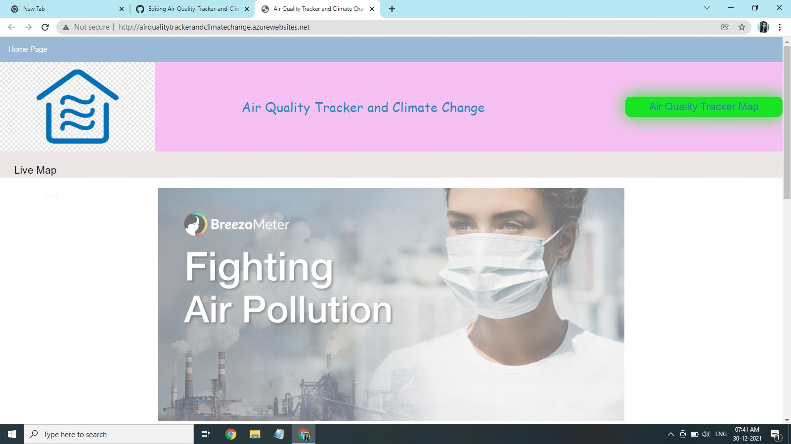
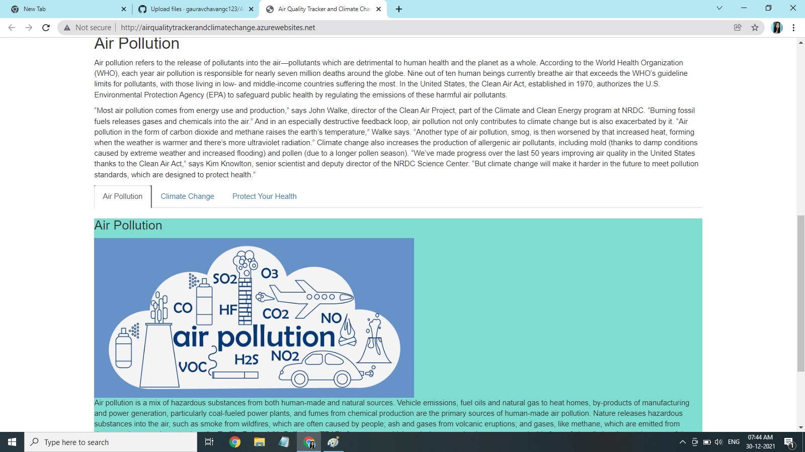
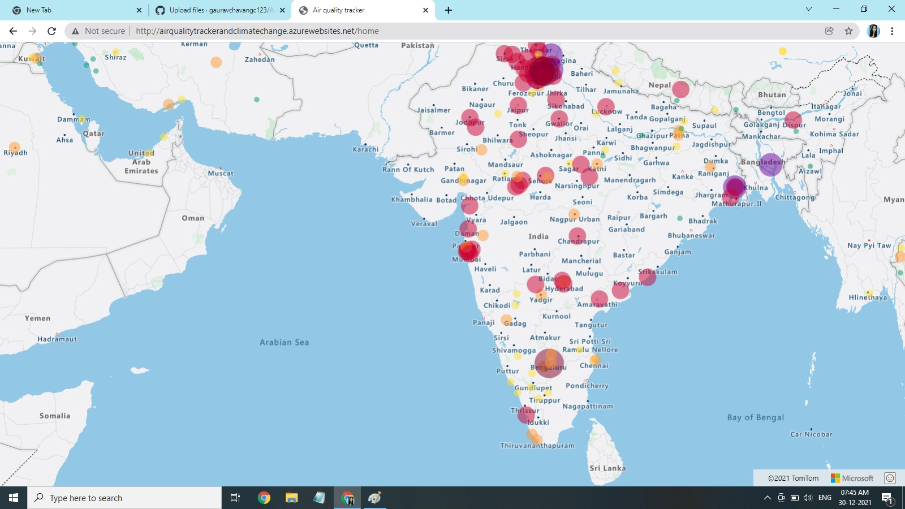

# Air Quality Tracker and Climate Change

This project is based on - [Create a Python app using Azure App Service](https://docs.microsoft.com/en-us/azure/app-service/quickstart-python?tabs=bash&pivots=python-framework-flask). Please read same for more information.

## Problem Statement/Opportunity : 
One of our era's greatest scourges is air pollution, on account not only of its impact on climate change but also its impact on public and individual health due to increasing morbidity and mortality. There are many pollutants that are major factors in disease in humans So in this project we are going to track air polluted areas using azure map service. It will be easy to reduce pollution of those areas by taking some precautions.

## Project Description :
The interactions between humans and their physical surroundings have been extensively studied, as multiple human activities influence the environment. The environment is a coupling of the biotic (living organisms and microorganisms) and the abiotic (hydrosphere, lithosphere, and atmosphere).
Pollution is defined as the introduction into the environment of substances harmful to humans and other living organisms. Pollutants are harmful solids, liquids, or gases produced in higher than usual concentrations that reduce the quality of our environment.
In this project we are going to track  air polluted areas which will be helpful to take action to prevent air pollution in detected polluted areas.This project is developed using visual Studio Code editor and run in python environment.This project containing CSS and HTML for web page designing.
And the very imaportant azure service which is used to track Air Quality is Azure Map Service. Which will show you  global map of Air Quality. 
## Azure Technology Used :
* App Service
* Visual Studio Code
* Azure Maps
## Set up initial environment
* Have an Azure account with an active subscription. [Create an account for free.](https://azure.microsoft.com/en-us/free)
* Install [Python 3.6 or higher.](https://www.python.org/downloads/) add in python path in your environment path.
* [Visual Studio Code](https://code.visualstudio.com/)
* [Install Visual Studio Code and the Python Extension](https://code.visualstudio.com/docs/python/python-tutorial)

## Configure environment
* Create folder and [Clon a repository](https://docs.github.com/en/repositories/creating-and-managing-repositories/cloning-a-repository) and open same folder in Visual Studio Code.
* In Visual Studio Code, select Terminal > New terminal to open the terminal.
* ``` python -m venv .venv ```
This command creates a virtual environment inside the current folder. Visual Studio Code detects this change and prompts you to select the virtual environment for this folder. Select Yes.
* Install pip packages using command ```pip install -r requirements.txt``` 
* At the root of your application code folder, create a new environment file named ```.env```.
* Create [Azure map account](https://docs.microsoft.com/en-us/azure/azure-maps/how-to-manage-account-keys) add  [primary key](https://docs.microsoft.com/en-us/azure/azure-maps/how-to-manage-authentication) in .env file - ```MAP_KEY=<your map key>```
* Create account on [World Air Quality Index](https://aqicn.org/data-platform/token/#/) and get *[WQAI_API_KEY](https://aqicn.org/data-platform/token/#/)*. Update ```WQAI_API_KEY=<WQAI api key>```

## Run and debug the app
* Set up Visual Studio Code to run and debug a Flask app. Then, use your browser to see the app in action.
* In Visual Studio Code, be sure that the *app.py* file is open in the editor. (Debug options vary based on the file you have open.) In the Activity Bar, select the **Run** icon. Under the **Run and Debug button**, select the **create and launch.json** file link. In the selection drop-down, choose the **Flask** link.
* When *Python:Flask* shows in the Run view, select the **green arrow** to run the application.
* Expected output : 
```
 * Serving Flask app "app.py"
 * Environment: development
 * Debug mode: off
 * Running on http://127.0.0.1:5000/ (Press CTRL+C to quit)
 ```
 * Open link on brower : http://127.0.0.1:5000/

## Deploying App to Azure App Service
* Deploy project to Azure App Service as part of your [continuous deployment (CD) workflows](https://docs.github.com/en/actions/deployment/deploying-to-your-cloud-provider/deploying-to-azure/deploying-python-to-azure-app-service).
* Configure [Azure Map key](https://docs.microsoft.com/en-us/azure/app-service/configure-common#configure-app-settings) - In the *Azure portal*, search for and select **App Services**, and then select your app. In the app's left menu, select **Configuration > Application settings**.
* In **[New application setting](https://docs.microsoft.com/en-us/azure/app-service/configure-language-python#access-app-settings-as-environment-variables)** add key *MAP_KEY* and value = *\<your map key\>*
* Also add key-value for *WQAI_API_KEY*
* Check deployment after Github action build completed, website link should avilable in *Github* build as well as *Azure App Service*. 
## Screenshot



### [Navigating the map](https://docs.microsoft.com/en-us/azure/azure-maps/map-accessibility#navigating-the-map)
There are several different ways in which the map can be zoomed, panned, rotated, and pitched. Check different ways to [navigate the map](https://docs.microsoft.com/en-us/azure/azure-maps/map-accessibility#navigating-the-map) using microsoft doc.
### [Keyboard shortcuts](https://docs.microsoft.com/en-us/azure/azure-maps/map-accessibility#keyboard-shortcuts)
The map has a number of keyboard shortcuts built in that make it easier to use the map. These [keyboard shortcuts](https://docs.microsoft.com/en-us/azure/azure-maps/map-accessibility#keyboard-shortcuts) work when the map has focus.
